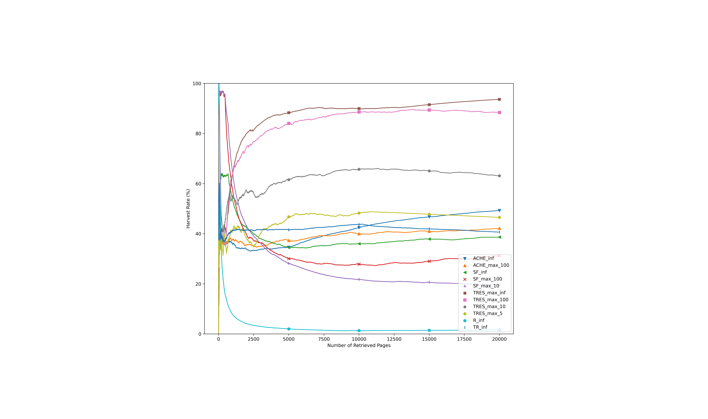

# Tree-based Focused Web Crawling with Reinforcement Learning

### Abstract


> A focused crawler aims at discovering as many web pages relevant to a target topic as possible, while avoiding irrelevant ones; i.e. maximizing the harvest rate. Reinforcement Learning (RL) has been utilized to optimize the crawling process, yet it deals with huge state and action spaces, which can constitute a serious challenge. In this paper, we propose Tree REinforcement Spider (*TRES*), an end-to-end RL-empowered framework for focused crawling. Unlike other crawling approaches, we properly model a crawling environment as a Markov Decision Process, by representing the state as a subgraph of the Web and actions as its expansion edges. Exploiting a few initial keywords, which are related to the target topic, TRES adopts a keyword expansion strategy based on the cosine similarity of keyword word2vec embeddings. To learn a reward function, we propose a deep neural network, called *KwBiLSTM*, leveraging the keywords discovered in the expansion stage. To reduce the time complexity of selecting a best action, we propose *Tree-Frontier*, a two-fold decision tree, which also speeds up training by discretizing the state and action spaces. Experimentally, we show that TRES outperforms state-of-the-art methods in terms of harvest rate by at least 58\%, while it has competitive results in the domain maximization setting, i.e. the task of maximizing the number of different fetched web sites.

Also, link to paper ([preprint](https://arxiv.org/abs/2112.07620)).

---

## Results


## Run locally

1. Git clone the repo.

```bash
git clone https://github.com/ddaedalus/tres.git
```

2. After you have extracted the .zip file and changed directory, install the requirements.
```bash
pip install -r requirements.txt
```

3. Download the "files" directory from [Google Drive](https://drive.google.com/drive/folders/16bQ9Xya50LX8VRIQguhvSHkLRsz2Kv3X?usp=sharing).

4. Create 2 files in the "files" directory: (a) seeds.txt with the seed URLs that the crawler would start its process and (b) data.txt providing relevant URLs (around 800-1000 at most) for training KwBiLSTM.

5. Modify the ./configuration/config.py file with your preferences.

6. Insert your keywords (and your keyphrases, if any) in the ./configuration/taxonomy.py

7. Run this command to extract new keywords.
```bash
python3 keyword_extract.py
```

8. Train the KwBiLSTM.
```bash
python3 run_classification.py
```

9. Start your focused crawling.
```bash
python3 run_crawling.py
```

---

## Citation

If you find this work helpful in your research, cite:
```
@article{Kontogiannis2021TreebasedFW,
  title={Tree-based Focused Web Crawling with Reinforcement Learning},
  author={A. Kontogiannis and Dimitrios Kelesis and Vasilis Pollatos and Georgios Paliouras and George Giannakopoulos},
  journal={ArXiv},
  year={2021},
  volume={abs/2112.07620}
}
```
